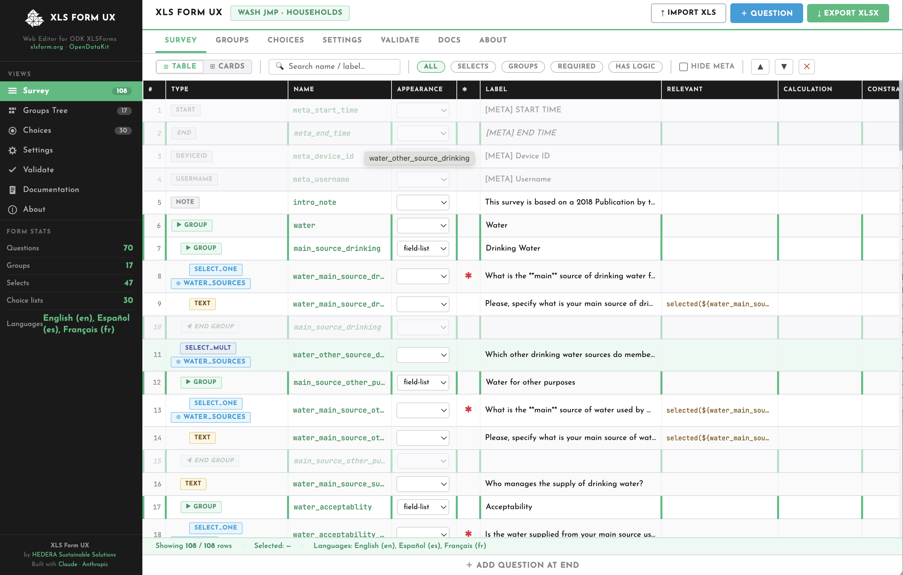
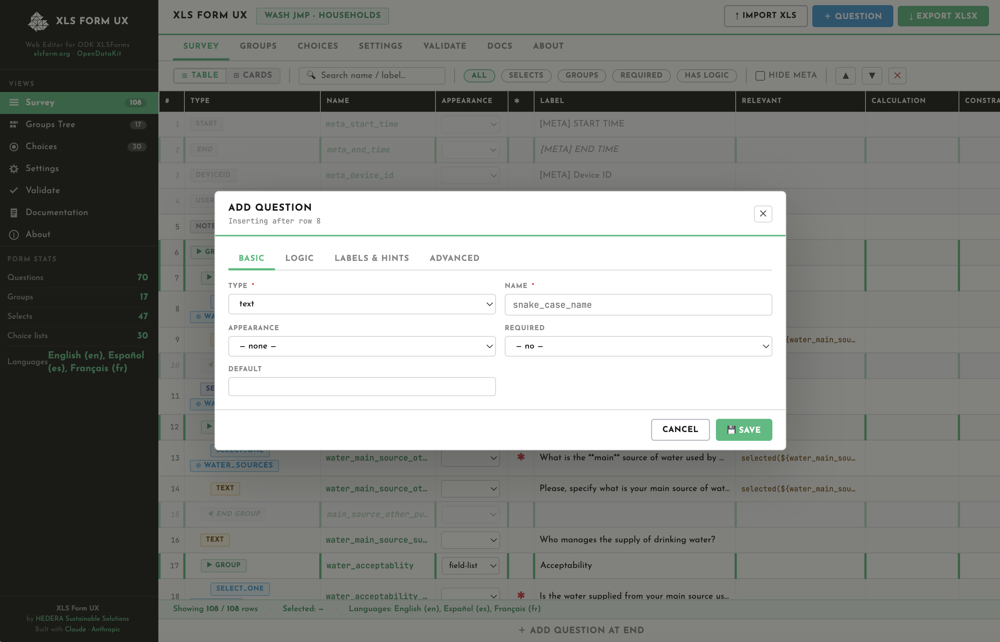
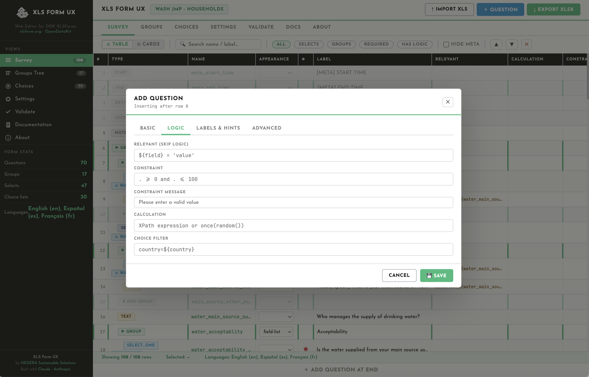
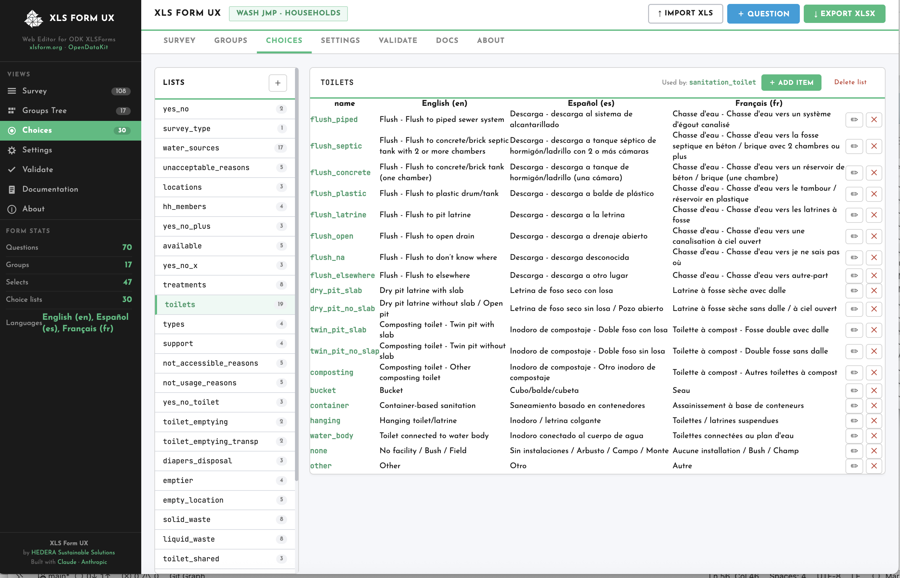
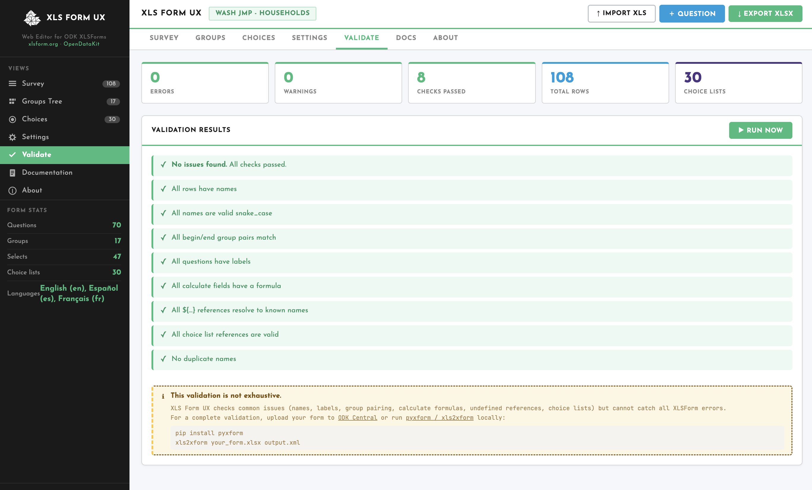

# XLF Form UX: Web Editor Interface for XLF Form

A browser-based editor for survey in [XLSForms](https://xlsform.org/en/). Open `index.html` in any modern browser — no server or installation needed.

## Project structure

```
root/
├── index.html              # Entry point — HTML shell + all markup
├── README.md
├── css/
│   └── builder.css         # All styles (design tokens, layout, components)
├── js/
│   ├── state.js            # App state object + import / file parsing
│   ├── render.js           # Tab switching, renderAll(), table view, cards view
│   ├── panels.js           # Groups tree, Choices panel, Settings panel, Validation, Export
│   ├── docs.js             # Documentation tab content (renderDocs)
│   ├── modals.js           # Edit-question modal + Choice list modal
│   └── utils.js            # Helpers (esc, safeId, toast, keyboard, init)
└── assets/
    └── icons/
        └── favicon.svg     # App icon
```

## Basic Usage Workflow

- Open `index.html` in Chrome, Firefox, Edge, or Safari.

- Drag your `.xlsx` ODK form onto the upload zone, or click **Import XLS**.



- Add and/or edit questions in the table or cards view. To add a question, place the mouse between two question rows, and button with "INSERT" will appear.



- Edit question properties, including logic and related messages



- Edit (add/remove) choice sheet and labels in the different available languages



- Use **Validate** to check the form before exporting.



**Note**: the validation also requires `end group` type questions to have a name, equal to the `begin group` question. This is not stricly required for ODK but it is something that we recommend for consistency and well-structure of the survey.

 
- Click **Export XLSX** to download the updated form.

## Keyboard shortcuts

| Key | Action |
|---|---|
| `↑` / `↓` | Navigate rows |
| `Enter` | Edit selected row |
| `N` | Add question after selected row |
| `Delete` | Delete selected row |
| `Esc` | Close modal |

## Design

- **Font**: Josefin Sans (UI) + JetBrains Mono (code/formulas)  
- **Palette**: SDG-inspired — green `#37BC7D`, UN blue `#009EDB`, yellow `#FDC745`, red `#E5243B`  
- **External dependencies**: [SheetJS (xlsx)](https://cdnjs.cloudflare.com/ajax/libs/xlsx/0.18.5/xlsx.full.min.js) loaded from CDN; Google Fonts loaded from CDN. Everything else is vanilla JS/CSS.


## Acknowledgment

Application designed and built with the AI assistance of Claude by [Anthropic](https://anthropic.com). We acknolwedge the great
support and service for the community of ODK.